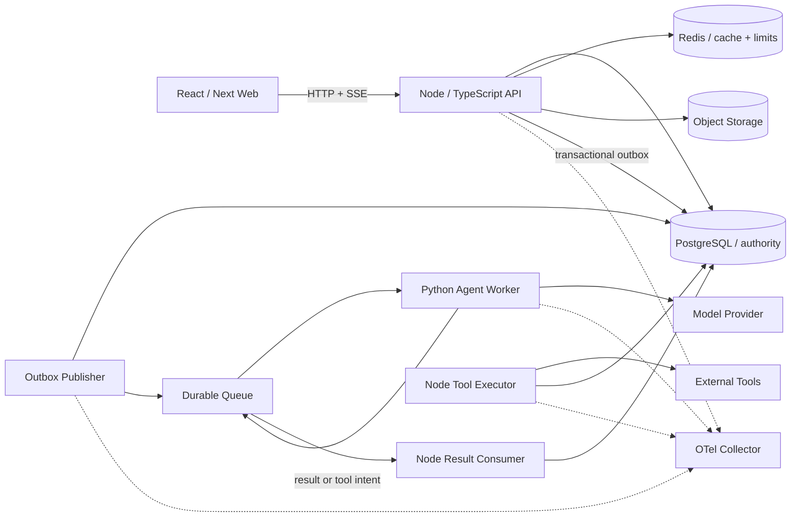

# 第 22 章答案与验收基线

没有唯一架构答案。下面是一套足够小、又能证明生产能力的基线。若你的方案不同，只要能以不变量和证据说明取舍，同样合格。

## 练习一答案：旗舰项目参考实现

### 1. 架构



只拆 Python worker；Node 内部按模块隔离，不把每张表变成服务。

### 2. 仓库结构

```text
operations-copilot/
├── apps/
│   ├── web/                 # React/Next
│   ├── api/                 # Fastify composition root
│   ├── outbox-publisher/
│   ├── tool-executor/
│   └── agent-worker/        # Python/Pydantic
├── packages/
│   ├── domain/              # 无 Fastify/ORM import
│   ├── application/         # use cases + ports
│   ├── contracts/           # HTTP/event/Node-Python schemas + fixtures
│   ├── database/            # SQL, migrations, repositories
│   ├── observability/
│   └── test-kit/
├── deploy/
│   ├── compose/
│   ├── kubernetes/
│   └── dashboards/
├── docs/
│   ├── adr/
│   ├── threat-model/
│   ├── runbooks/
│   ├── evidence/
│   └── interview/
└── evals/
    ├── datasets/
    ├── graders/
    └── reports/
```

### 3. 最小权威表

```sql
create table agent_runs (
  id uuid primary key,
  tenant_id uuid not null references tenants(id),
  ticket_id uuid not null,
  idempotency_key text not null,
  request_hash text not null,
  generation integer not null default 1 check (generation > 0),
  status text not null check (status in (
    'queued','running','waiting_approval','succeeded','failed','cancelled'
  )),
  cancel_requested_at timestamptz,
  result jsonb,
  created_at timestamptz not null default now(),
  updated_at timestamptz not null default now(),
  unique (tenant_id, id),
  unique (tenant_id, idempotency_key),
  foreign key (tenant_id, ticket_id) references tickets(tenant_id, id)
);

create table run_events (
  tenant_id uuid not null,
  run_id uuid not null,
  seq bigint not null check (seq > 0),
  type text not null,
  payload jsonb not null,
  occurred_at timestamptz not null default now(),
  primary key (run_id, seq),
  foreign key (tenant_id, run_id) references agent_runs(tenant_id, id)
);

create table outbox_events (
  id uuid primary key,
  tenant_id uuid not null,
  aggregate_type text not null,
  aggregate_id uuid not null,
  type text not null,
  payload jsonb not null,
  created_at timestamptz not null default now(),
  published_at timestamptz
);

create index outbox_unpublished
on outbox_events (created_at, id)
where published_at is null;

create table inbox_messages (
  id uuid primary key,
  tenant_id uuid not null,
  received_at timestamptz not null default now()
);
```

所有被复合 FK 引用的父表需要对应 `unique (tenant_id, id)`。真实 migration 还应加入 tool intents、usage ledger 与审计表。

### 4. 创建 run 的事务边界

下面的 use case 展示“幂等记录、权威 run、首事件和 Outbox 同一提交”：

```ts
import { createHash, randomUUID } from "node:crypto";
import type { Pool } from "pg";

type CreateRun = Readonly<{
  tenantId: string;
  userId: string;
  ticketId: string;
  idempotencyKey: string;
  workflow: "ticket-triage";
}>;

function requestHash(input: CreateRun): string {
  return createHash("sha256")
    .update(JSON.stringify({ ticketId: input.ticketId, workflow: input.workflow }))
    .digest("hex");
}

export async function createAgentRun(pool: Pool, input: CreateRun) {
  const client = await pool.connect();
  const hash = requestHash(input);
  try {
    await client.query("begin");
    const visible = await client.query(
      `select 1 from tickets t
        join project_memberships m
          on m.tenant_id = t.tenant_id and m.project_id = t.project_id
       where t.tenant_id = $1 and t.id = $2 and m.user_id = $3`,
      [input.tenantId, input.ticketId, input.userId],
    );
    if (!visible.rowCount) throw new Error("NOT_FOUND");

    const runId = randomUUID();
    const outboxId = randomUUID();
    const inserted = await client.query(
      `insert into agent_runs
       (id, tenant_id, ticket_id, idempotency_key, request_hash, status)
       values ($1,$2,$3,$4,$5,'queued')
       on conflict (tenant_id, idempotency_key) do nothing
       returning id, request_hash, status`,
      [runId, input.tenantId, input.ticketId, input.idempotencyKey, hash],
    );
    if (inserted.rowCount === 0) {
      const existing = await client.query(
        `select id, request_hash, status
           from agent_runs
          where tenant_id = $1 and idempotency_key = $2`,
        [input.tenantId, input.idempotencyKey],
      );
      if (existing.rows[0]?.request_hash !== hash) {
        throw new Error("IDEMPOTENCY_CONFLICT");
      }
      await client.query("commit");
      return { replayed: true, run: existing.rows[0] };
    }
    await client.query(
      `insert into run_events (tenant_id, run_id, seq, type, payload)
       values ($1,$2,1,'run.queued',$3::jsonb)`,
      [input.tenantId, runId, JSON.stringify({ workflow: input.workflow })],
    );
    await client.query(
      `insert into outbox_events
       (id, tenant_id, aggregate_type, aggregate_id, type, payload)
       values ($1,$2,'agent_run',$3,'agent.run.requested',$4::jsonb)`,
      [outboxId, input.tenantId, runId, JSON.stringify({ runId, workflow: input.workflow })],
    );
    await client.query("commit");
    return { replayed: false, run: { id: runId, status: "queued" } };
  } catch (error) {
    await client.query("rollback");
    throw error;
  } finally {
    client.release();
  }
}
```

这里用 `ON CONFLICT DO NOTHING` 原子决定创建者；失败者重查并比较 request hash。高吞吐系统也可使用独立 `idempotency_records` 状态机，保存执行中、已完成与响应快照。

### 5. 状态所有权

| 状态/数据 | Owner | 可派生副本 |
|---|---|---|
| ticket/run/tool 状态 | PostgreSQL + Node | Redis、React Query |
| Agent checkpoint | PostgreSQL 对应版本记录 | queue payload |
| 模型中间 token | 可批量事件化 | SSE/UI buffer |
| 用户授权 | Node policy + DB membership | 短 TTL policy cache |
| tool 副作用 | Node executor + provider receipt | Agent 文字描述不是证据 |
| Eval 结果 | 版本化评测存储 | dashboard |

### 6. 分阶段验收清单

**A：问题与设计**

- [ ] 3 次以上用户访谈或真实内部流程记录；
- [ ] 范围内/外、十条不变量、ERD、状态机、权限矩阵；
- [ ] 至少 5 个 ADR 和一份威胁模型。

**B：可靠 SaaS**

- [ ] 所有租户查询带复合作用域；
- [ ] 数据库约束、游标、并发和 migration 测试；
- [ ] 无 AI 时完整人工流程可用；
- [ ] React E2E、可访问性和性能 baseline。

**C：异步底座**

- [ ] Outbox/Inbox、at-least-once、checkpoint/generation；
- [ ] SSE replay/backpressure/cancel；
- [ ] Redis flush 后重建；
- [ ] 重复、乱序、commit/ack 崩溃测试。

**D：Agent 与 HITL**

- [ ] Node/Python 契约 fixture；
- [ ] 固定 Eval 与升级门槛；
- [ ] tool intent 参数 hash、重新授权、幂等执行；
- [ ] Prompt Injection、SSRF、预算和秘密测试。

**E：生产证据**

- [ ] OTel 跨进程 trace 与脱敏测试；
- [ ] SLI/SLO、dashboard、burn-rate 告警；
- [ ] 负载拐点与 30% 容量余量；
- [ ] canary/rollback 和 PITR/DR 演练。

**F：作品与用户**

- [ ] 公共 Demo 或可验证的受限环境；
- [ ] 三轮用户反馈和指标改进；
- [ ] 中英文 README、5 分钟视频、45 分钟答辩；
- [ ] 已知风险和下一步，不夸大生产规模。

### 7. 证据索引

建议 `docs/evidence/README.md`：

```md
# Evidence Index

| 能力 | 主张 | 证据 | 复现命令 | 当前限制 |
|---|---|---|---|---|
| 幂等 | 重复创建只产生一个 run | concurrency-idempotency.md | pnpm test:idempotency | 单区域 |
| 租户 | IDOR 与缓存均隔离 | tenant-red-team.md | pnpm test:tenant | 平台运维另审计 |
| 恢复 | RPO/RTO 达标 | dr-2026-08.md | docs/runbooks/dr.md | 每季度演练 |
| Agent | 固定集质量与成本 | eval-v3.md | uv run eval | 仅中文工单 |
```

### 8. ADR 模板

```md
# ADR-00X：决策标题

- 状态：Proposed / Accepted / Superseded
- 日期、Owner
- 上下文与不可违反的不变量
- 考虑方案
- 决策与原因
- 正面/负面后果
- 失败与回滚方式
- 要观察的指标
- 重新评估触发条件
```

不要写“选择 Redis，因为快”；写清它不拥有事实、失效策略、故障行为和退出条件。

## 练习二答案：系统设计、红队与现场变更

### 1. 评分表

| 维度 | 0 分 | 1 分 | 2 分 |
|---|---|---|---|
| 问题澄清 | 直接画技术 | 有规模无用户 | 用户、规模、SLO、范围明确 |
| 数据权威 | 多处真相 | 口头称 PG 权威 | 表、事务、重建路径有证据 |
| 多租户 | 只在路由检查 | service 有 scope | DB/缓存/对象/任务纵深 |
| 失败语义 | 只说重试 | 部分状态机 | 重复乱序超时崩溃均有归属 |
| Agent 边界 | 模型直接执行 | 有 Schema | intent、HITL、策略、预算、审计 |
| 可观测 | 打日志 | metric/trace | 用户 SLO、因果 trace、runbook |
| 发布恢复 | Docker 即完成 | 有 CI/备份 | 兼容 migration、canary、实测 DR |
| 证据表达 | 只讲技术名 | 展示代码 | 指标、测试、取舍、限制均清楚 |

满分 16；12 分以上且没有租户/副作用/恢复的零分项才建议通过。

### 2. 现场变更示例：双人四眼审批

不要只给审批表加两个 user ID。先修改不变量：高风险 intent 必须由两个不同、当前仍有权限的人批准；提出者不能批准；任何一次参数变化使全部审批失效。

数据演进：

```sql
create table tool_approvals (
  tenant_id uuid not null,
  intent_id uuid not null,
  approver_id uuid not null,
  args_hash text not null,
  approved_at timestamptz not null default now(),
  revoked_at timestamptz,
  primary key (tenant_id, intent_id, approver_id),
  foreign key (tenant_id, intent_id) references tool_intents(tenant_id, id)
);
```

执行 claim 需在同一事务中确认：两个不同有效 approver、hash 相同、均不是 proposer、当前仍有角色、intent 未过期。变更采用 expand：先建表并 dual-read，旧 intent 维持旧策略标记；新 intent 带 `required_approvals=2`；观察后再移除旧单审批列。

新增指标：审批等待时间、第二审批拒绝率、过期率；新增测试：同一人重复批准、权限撤销、参数替换、并发第二批准与执行竞争。

### 3. 常见追问参考

**为什么不把所有东西拆微服务？**

当前团队和规模下，模块化单体减少分布式事务、发布和调试成本；Python worker 因运行时、风险和扩缩容独立而拆。以数据所有权、容量或团队边界作为未来拆分触发条件。

**Redis 全丢怎么办？**

Redis 不拥有业务事实。清空后限流按明确故障策略运行，缓存从 PostgreSQL 回填；用压测控制回暖，防止击穿。若某数据不能重建，就应迁回权威存储。

**外部邮件可能成功但响应丢失怎么办？**

以 intent ID 传供应商 idempotency key；超时后查询结果。供应商不支持时进入 unknown/reconciliation，不盲目重发；必要时通过业务补偿并向用户展示不确定状态。

**为什么 SSE 断开不取消任务？**

传输与业务是两个状态机。网络抖动只释放订阅；取消是有鉴权、持久、幂等命令，由 worker 观察并 checkpoint。

**模型升级怎么发布？**

模型/Prompt/工具协议作为版本；固定 Eval 比较质量、延迟、成本和安全；影子或小流量 canary；旧版本可回退；run 记录所用版本以便复盘。

**如何证明没有跨租户泄漏？**

不能证明绝对没有，只能展示纵深：可信 tenant context、repository 强制 scope、复合 FK/唯一、RLS、缓存/对象 key、队列 envelope、红队与属性测试、审计和安全告警。

### 4. 失败复盘模板

```md
# Incident：标题

- 用户影响与时间范围
- 检测方式；为什么没有更早发现
- 精确时间线
- 技术与组织诱因
- 哪条不变量被破坏
- 临时缓解与永久修复
- 数据/外部副作用 reconciliation
- 测试、指标、runbook、owner 与截止日期
- 哪些事情不是根因
```

复盘不写“某同学粗心”，要解释系统为何允许单点错误到达用户。

### 5. 最终面试材料

- 一页用户问题与量化结果；
- 一页架构和数据权威；
- 一页 Agent/HITL 信任边界；
- 一页最难故障与修复；
- 一页 SLO、容量和成本；
- 一页发布、回滚和 DR；
- Demo、代码、测试和 evidence index 可随追问打开；
- 一页“如果再做一次会改什么”。

常见失败：做成聊天 UI、没有真实用户、所有状态放 Redis、Agent 直接写库、只演示成功路径、声称 exactly-once、只有单元测试、没有恢复演练、用大量云组件掩盖业务不变量。

复写任务：不看答案画完整架构、写十条不变量和六阶段验收；随机抽一个现场变更，在 15 分钟内修改数据、失败语义、迁移、测试和指标，然后录下第二次答辩。
