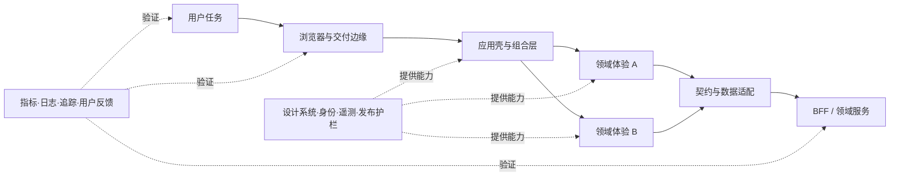

# 01｜架构师视角与质量属性

> 决策快照：截至 2026-08-16。本文讨论稳定的架构判断方法；框架版本与岗位信号按该日期理解。
> 目标读者已经会写业务组件，本章不再教授 Hook、Vue API 或脚手架配置。

## 市场与业务为什么关心

高级前端岗位很少只考察“页面能否实现”。真实职责还包括技术选型、复杂系统演进、性能与稳定性、组件和工具链、跨团队交付，以及 AI 生成代码进入生产后的质量兜底。这些要求共同指向一个变化：工程师开始对系统结果负责，而不只是对自己提交的代码负责。

业务真正关心的通常是以下结果：

- 用户能否在目标设备和网络下完成关键任务；
- 需求能否在可接受时间内安全上线；
- 一次变更会影响多少页面、团队和用户；
- 故障能否被发现、隔离、降级和恢复；
- 安全、隐私与可访问性是否成为默认能力；
- 系统两年后的维护与迁移成本是否仍可承受。

“架构师视角”不是职位名称，也不是画更多框图，而是在互相冲突的目标中作出可解释、可验证、可逆转的决定。

### 本章非目标

- 不给某个框架排绝对名次；框架熟悉度只是成本信息。
- 不把微前端、Monorepo、SSR、RSC、Edge 或 Rust 当作架构成熟度证明。
- 不追求一次设计出永久正确的目标架构。
- 不用抽象层数、文档页数或代码行数衡量高级程度。
- 不替代现有 Master 中的浏览器、React、后端与 Agent 实现课程。

## 核心模型一：架构管理的是高代价决策

可以把架构理解为：影响系统重要质量、改变代价较高、需要多人协调的决策集合。目录命名通常容易改，身份边界、数据所有权、发布单元、渲染模式和跨团队契约则往往很贵。

判断一个问题是否进入架构层，可以连续问四次：

1. 它影响的是单个实现，还是多个用户旅程或团队？
2. 判断错误后，能否在一天内安全回退？
3. 它是否改变安全、可靠性、性能或交付能力？
4. 它是否需要持续的兼容、运营和所有权？

回答“是”越多，越需要留下约束、备选、决策与复审证据。

## 核心模型二：把形容词改写成质量属性场景

“高性能”“高可用”“可维护”无法直接评审。一个可验证的质量属性场景应包含六项：

| 要素 | 要回答的问题 |
| --- | --- |
| 刺激来源 | 谁或什么触发事件 |
| 刺激 | 到底发生了什么 |
| 环境 | 正常、峰值、发布中还是依赖故障时 |
| 制品 | 页面、模块、API、流水线还是组织接口 |
| 响应 | 系统应采取什么行为 |
| 响应度量 | 多快、多少、成功率或影响范围是多少 |

例如，“结算页要快”应改写为：促销峰值时，移动端用户从购物车进入结算页；系统先显示可操作骨架并并行获取价格与库存；目标设备群的真实用户 LCP p75 小于既定预算，关键操作 INP p75 达标，失败时仍能保留购物车并给出可恢复路径。这里没有给出通用毫秒数，因为阈值必须来自产品目标、设备分布和现状基线，而不是课程作者的偏好。

### 常见质量属性及其冲突

| 质量属性 | 前端中的可观察结果 | 常见代价或冲突 |
| --- | --- | --- |
| 性能 | 加载、交互、任务完成时间 | 预取和缓存增加一致性与成本 |
| 可靠性 | 可用率、错误率、恢复时间 | 冗余与降级增加实现复杂度 |
| 可修改性 | 变更范围、交付时间、升级成本 | 过度抽象会降低局部清晰度 |
| 安全与隐私 | 越权、泄露、供应链风险 | 更严格边界可能增加交互步骤 |
| 可访问性 | 辅助技术下的任务成功率 | 需要设计、开发和测试共同投入 |
| 可观测性 | 定位与解释故障的能力 | 遥测会引入成本与隐私约束 |
| 可移植性 | 浏览器、端、地区适配成本 | 最小公分母可能牺牲平台能力 |
| 开发者体验 | 反馈时间、认知负担、成功率 | 平台建设本身需要长期运营 |

架构评审的重点不是让所有属性同时最大化，而是公开优先级、预算和让步。

## 从业务目标到技术决策

推荐用一棵小型效用树整理优先级：

- 业务目标：提高下单完成率；
  - 可靠性：支付依赖失败时不丢失订单意图；
  - 性能：弱网用户仍能在预算内进入可操作状态；
  - 安全：价格、权限与支付状态不能由浏览器自证；
  - 可修改性：新增支付方式不应改动全部页面；
- 业务目标：缩短交付周期；
  - 反馈：受影响测试与构建在目标时间内返回；
  - 解耦：一个领域变更不要求无关团队同步发布；
  - 恢复：发布可按版本和用户群快速回退。

每个叶子都应有场景、当前基线、目标、负责人和复审日期。

## 参考架构：关注责任，不迷信层数

这张图不是要求每个项目都建立 BFF 或平台团队，而是提醒你区分：

- 用户任务与页面组件不是同一个边界；
- 应用组合不应吞掉领域规则；
- 浏览器不能成为权限和关键业务事实的权威来源；
- 共享能力应提供安全默认值，而不是接管所有业务；
- 观测必须贯穿用户、版本、请求与服务，而不是只记浏览器异常。

## 一条可复用的决策闭环

1. 描述用户或开发者的问题，记录现状基线。
2. 列出业务、合规、团队、运行时和迁移约束。
3. 排序质量属性，并写出可测量场景。
4. 提出至少两个都能工作的候选方案。
5. 比较收益、最坏失败、运营成本和退出成本。
6. 用 RFC 讨论，用 ADR 留下决定及前提。
7. 先做可回滚的最小切片，观察领先指标与护栏指标。
8. 根据生产数据扩大、修正或停止，并删除过期兼容层。

架构不是“设计完成—交给团队”，而是一个带反馈和删除动作的循环。

## 选项与权衡

### 保持简单，还是建设共享平台

一个团队、一个应用、问题尚未重复时，局部实现通常更便宜。多个团队反复解决同一安全或交付问题，且差异不是业务价值时，平台化才可能产生净收益。平台降低的是重复认知负担，同时会新增版本、支持、兼容和治理成本，必须两边一起计算。

### 客户端完成，还是引入 BFF / 服务端渲染

纯客户端路径部署简单、端到端边界少，但可能放大瀑布请求、凭证暴露和首屏成本。BFF 或服务端渲染可以聚合数据、保护秘密和改善部分体验，也会增加服务运行、缓存一致性与故障面。应按页面、数据和失败语义选择，而不是按应用统一押注一种渲染方式。

### 一致性，还是团队自治

统一栈能降低流动与支持成本，过强统一会阻塞领域创新；完全自治能快速局部决策，也可能制造重复运行时、供应链和用户体验差异。成熟做法是统一安全底线与可交换接口，对局部实现保留有期限的例外机制。

### 自建，还是购买或采用开源

购买减少早期建设，可能增加锁定、数据边界和单位成本；自建贴合内部流程，却容易低估产品运营。开源免除许可证费用不等于免除升级、托管和响应责任。比较时应用总拥有成本，而不是只比较首月开发量。

## 失败模式与反花架子门槛

### 常见失败模式

- 从技术名词出发，再倒推一个问题；
- 只展示成功路径，没有超时、回滚、降级和数据恢复；
- 用平均值掩盖弱网、低端设备和长尾用户；
- 把共享代码误认为稳定契约，导致任意变更全仓传播；
- 把“统一”当目标，却没有采用率、例外和退出机制；
- RFC 批准后不再复审，原先前提失效仍继续扩张；
- 架构团队给出规则，却不承担迁移、支持和事故责任；
- AI 生成更多代码，却让评审、依赖和故障成本上升。

### 六道采用门

任何较大架构投入至少应通过：问题证据、质量目标、可行替代、失败恢复、长期所有权、退出删除。如果没有基线，先测量；没有回滚，先缩小变更；没有所有者，默认不引入。

“未来可能需要”可以进入风险清单，但不能单独成为大规模建设的理由。

## 平台与组织视角

架构权力应靠反馈和责任，而不是靠审批地位。领域团队拥有业务结果；平台团队把反复出现的非差异化能力做成内部产品；安全、可访问性和可靠性专家提供政策、自动化护栏与例外审查。

一个健康治理模型通常包含：

- 每个重要系统、包、数据和发布路径有明确所有者；
- RFC 处理高影响、跨团队决策，ADR 保存已作决定；
- Golden Path 是低摩擦默认路径，不是强迫所有场景相同；
- 例外需要风险、负责人、补偿措施和到期复审；
- 平台团队跟踪采用、任务成功、支持负担和用户满意度；
- 事故与迁移结果反向更新原则、模板和自动检查。

架构负责人最重要的产物不是图，而是组织能够持续作出好决定的机制。

## 指标：同时观察结果、流动和风险

### 用户与业务结果

- 核心旅程任务成功率与放弃率；
- Core Web Vitals 的真实用户 p75，并按设备、网络和地区切片；
- 可访问性关键任务成功率；
- 受影响用户数、故障持续时间与数据损失量。

### 交付与可修改性

- 变更从主干到生产的 p50 / p75 时间；
- 一项领域需求涉及的包、仓库、团队和同步发布数；
- 变更失败率、回滚率与恢复时间；
- 本地和 CI 的可信反馈时间、等待时间与重试率。

### 平台与治理

- Golden Path 采用率、成功率和绕过原因；
- 平台支持工单、文档自助解决率和开发者满意度；
- 过期例外、废弃 API、兼容层与无主资产数量；
- 安全、隐私、依赖和可访问性缺陷的逃逸率及修复时间。

指标必须能触发继续、停止或修正。Lighthouse 满分、代码行数、平台页面访问量和 AI 接受率都不能单独证明架构价值。

## 架构评审清单

- [ ] 问题是否用用户或开发者结果描述，而非产品名？
- [ ] 当前基线、目标人群和约束是否可复核？
- [ ] 优先质量属性及允许牺牲的属性是否明确？
- [ ] 是否写出了刺激、环境、响应和度量？
- [ ] 是否至少比较两个真正可行的方案？
- [ ] 安全、隐私、可访问性和合规是否进入主设计？
- [ ] 最坏失败会影响谁，能否隔离和降级？
- [ ] 数据权威、身份边界和缓存语义是否清楚？
- [ ] 是否可增量上线、观测、回滚并删除旧路径？
- [ ] 建设、云资源、升级、支持和迁移成本是否都计算？
- [ ] 系统、包、平台和例外是否有长期所有者？
- [ ] 指标是否包含结果、护栏和反证信号？
- [ ] 决策前提变化时，谁在什么日期复审？
- [ ] AI 或自动化扩大速度后，验证与责任是否同步扩大？

## 官方与一手延伸阅读

- [SEI：Quality Attribute Workshop](https://www.sei.cmu.edu/our-work/software-architecture/quality-attribute-workshop/)
- [ISO/IEC 25010 产品质量模型](https://www.iso.org/standard/78176.html)
- [AWS Well-Architected Framework](https://docs.aws.amazon.com/wellarchitected/latest/framework/welcome.html)
- [W3C Web Content Accessibility Guidelines](https://www.w3.org/WAI/standards-guidelines/wcag/)
- [web.dev：Web Vitals](https://web.dev/articles/vitals)
- [Google Cloud：DORA 能力与研究](https://dora.dev/research/)
- [Thoughtworks Technology Radar：采用生命周期](https://www.thoughtworks.com/radar)

## 与现有 Master 交叉学习

- 语言、浏览器质量机制：回看 [JS 与浏览器 14：Web 安全](../《JavaScript%20与浏览器高级学习问题》/14-Web安全与前端信任边界/00-讲义.md)、[15：性能与度量](../《JavaScript%20与浏览器高级学习问题》/15-JS引擎内存性能与度量/00-讲义.md)、[16：可靠交付](../《JavaScript%20与浏览器高级学习问题》/16-调试测试可观测与可靠交付/00-讲义.md)。
- 类型与运行时边界：回看 [TS 10：Schema 验证](../TS%20Master/10-运行时边界与Schema验证/00-讲义.md) 与 [TS 16：大型代码库](../TS%20Master/16-大型代码库架构与性能/00-讲义.md)。
- React 生产质量：回看 [React 12：测试策略](../React%20Master/12-测试策略与可靠交付/00-讲义.md)、[14：SSR / RSC](../React%20Master/14-SSR-RSC与Nextjs/00-讲义.md)、[15：可访问性、安全与观测](../React%20Master/15-可访问性安全与可观测性/00-讲义.md)。
- 服务可靠性：回看 [Backend 15：韧性与过载保护](../Backend%20Master/15-超时重试熔断隔舱与过载保护/00-讲义.md)、[20：SLO 与容量](../Backend%20Master/20-日志Metrics-Trace-SLO与容量工程/00-讲义.md)、[21：发布与恢复](../Backend%20Master/21-容器CI-CD云发布与灾难恢复/00-讲义.md)。
- AI 质量与责任：回看 [AI Agent 17：Evals](../AI%20Agent%20Master/17-Evals测试与质量闭环/00-讲义.md)、[19：安全与沙箱](../AI%20Agent%20Master/19-Agent安全隐私与沙箱/00-讲义.md)、[20：生产架构](../AI%20Agent%20Master/20-生产架构部署与运维/00-讲义.md)。

本章的完成标准不是记住质量属性名称，而是以后看到“统一技术栈”“上微前端”“做平台”时，先问结果、约束、取舍、失败、指标和退出。
