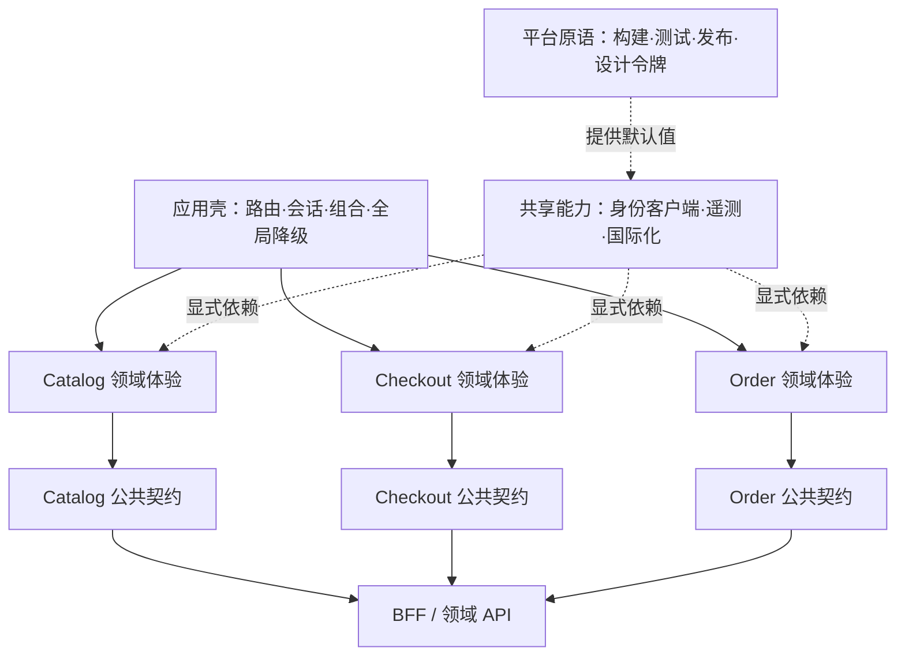

# 02｜业务领域边界与前端模块化

> 决策快照：截至 2026-08-16。领域边界是长期原则；React、Vue 或微前端实现只代表可替换手段。
> 本章讨论怎样拆系统，不教授组件、路由、状态库或目录配置。

## 市场与业务问题

一个前端通常不是因为组件写得少而失控，而是因为不同业务变化被放进同一个修改面：订单规则改动触发会员页面回归，营销组件能直接改支付状态，公共 Store 成为所有模块的隐式消息总线。在小团队和早期产品里，这些捷径可能很快；随着产品线、合规要求、交付频率和团队数量增长，它们会转化为：

- 任意需求都需要跨模块搜索和多人确认；
- 同名业务概念在页面、接口和埋点中含义不同；
- 一个共享包升级迫使无关应用同时回归；
- 权限和数据规则只存在于视图判断中；
- 团队名义上独立，实际上必须同步发布；
- 遗留系统无法按业务价值逐段替换。

高级前端需要把“页面怎么分”提升为“变化因为什么发生、由谁拥有、通过什么契约传播”。

### 本章非目标

- 不把完整 DDD 理论搬进每个前端项目。
- 不要求前后端按相同目录或相同服务数量切分。
- 不把微前端等同于模块化，也不预设独立部署一定更好。
- 不消灭所有重复；少量稳定重复可能比错误共享便宜。

## 核心模型：变化原因决定边界

一个好边界应尽量让内部高内聚、外部低耦合。判断时不要先看文件数量，而要观察以下信号：

1. **业务语言**：同一个词在边界内是否具有稳定含义？
2. **规则与不变量**：哪些状态转换必须一起维护？
3. **变化节奏**：哪些能力经常因同一个业务目标同时改变？
4. **数据权威**：谁能创建、确认或纠正某项事实？
5. **失败语义**：哪个故障应独立隔离、降级或恢复？
6. **所有权**：是否有团队能够端到端承担结果？
7. **生命周期**：能力能否独立演进、废弃和迁移？

如果两个模块只是 UI 外观相似，却由不同规则、团队和生命周期驱动，强行共享会制造耦合。如果两个页面外观差异很大，却围绕同一不变量变化，它们可能属于同一领域。

## 从业务能力到前端垂直切片

推荐沿下面的链条建模：

> 业务能力 → 限界上下文 → 用户旅程 → 前端领域模块 → 契约与数据 → 团队所有权

以电商为例，可以先得到 Catalog、Cart、Checkout、Order、Account 等上下文，而不是 components、pages、stores、services 四个水平大目录。Catalog 可以决定商品展示语义，但不能确认成交价格；Checkout 可以组织结算意图，但支付结果必须来自服务端权威；Order 可以呈现履约状态，但不能通过改前端 Store 伪造发货。边界的价值正在于让这些差异可见。

## 参考架构：壳、领域、共享能力与平台原语

建议的依赖方向是：组合层可以认识领域，领域可以使用稳定共享能力，共享能力可以使用平台原语；反方向不能导入业务规则。不同领域之间若要协作，应通过公开契约、组合层或明确事件完成，而不是深层导入对方内部文件。

## 一个前端领域模块至少说明什么

模块边界不是一个文件夹名。它至少应暴露以下信息：

- 业务职责与明确非职责；
- 公共入口，以及禁止外部使用的内部实现；
- 接受的命令、查询、事件和返回错误；
- 使用的数据来源、缓存键与失效语义；
- 能做与不能做的权限动作；
- 路由、埋点、国际化和可访问性责任；
- 浏览器副作用及清理方式；
- 兼容策略、弃用期限和负责人；
- 本地验证方式与生产观测信号。

公共 API 越小越好，但不能小到迫使消费者通过深层导入绕开它。

## 前端特有的六类边界

### URL 与导航边界

URL 是跨刷新、分享、回退和多入口的公共协议。领域模块可以拥有自己的路由段，但应用壳应控制顶层导航、鉴权入口和未知路由恢复。

### 状态边界

领域状态优先留在领域内。跨领域共享的是稳定事实或显式事件，而不是让所有模块读写一个无约束全局对象。服务端状态缓存也需要领域化键、租户和身份范围；缓存库不是数据所有者。

### 数据与契约边界

传输 DTO、领域模型和视图模型有不同变化原因。把后端 JSON 原样传播到所有组件，会让一次字段演进穿透整个前端。适配器应在边界处验证、转换并保留未知与失败语义。

### 权限边界

隐藏按钮只改善体验，不构成授权。前端可以根据能力声明组织界面，真正的资源授权仍由服务端执行。领域模块应统一解释能力，不应让每个组件重新拼角色字符串。

### 体验与设计边界

设计系统拥有令牌、基础交互和可访问原语；领域拥有业务任务、文案语义与流程。把完整结算流程塞进通用组件库，会让设计系统承担错误的业务变化。

### 遥测边界

平台提供事件发送、隐私过滤和版本关联；领域定义业务事件的语义与成功标准。埋点不能绕开领域接口直接读取内部状态。

## 选项与权衡

### 水平分层、功能切片还是领域模块

| 方式 | 适合情况 | 主要风险 |
| --- | --- | --- |
| UI / Store / API 水平分层 | 小应用、规则简单、单团队 | 一项需求横跨所有层，所有权模糊 |
| 按页面或功能切片 | 交付节奏快、页面相对独立 | 相同领域规则在页面间复制或冲突 |
| 按领域垂直模块 | 规则复杂、多团队、长期演进 | 需要业务建模，边界判断会迭代 |

现实项目常采用组合：领域作为主要所有权边界，领域内部再按视图、应用服务和适配器组织。

### 复制，还是共享

当代码只是看起来相似、变化原因不同，先复制通常更安全。当多处表达同一个政策、不变量或无差异能力，并且有共同所有者时，才提取共享。提取前至少观察两到三个真实消费者，确认公共契约，而不是根据第一个页面预言未来。

### 构建时组合，还是运行时组合

单应用、同一发布节奏下，构建时组合最简单。真正存在独立团队、独立发布、隔离或技术栈迁移需求时，运行时组合才值得评估。运行时组合会新增依赖重复、版本协调、路由、身份、样式、观测和故障隔离成本。微前端不能修复错误的业务边界，只会把它搬到网络与运行时。

### 直接调用，还是领域事件

调用方需要立即结果且流程由它拥有时，显式调用更清楚。多个消费者对已发生事实独立反应时，领域事件能降低直接依赖。事件也会引入顺序、重复、丢失、版本与追踪问题；不要为了“解耦”把同步业务流程伪装成不可观察的事件链。

### 与后端一一对齐，还是按前端旅程聚合

前端领域可与后端上下文对齐业务语言和权威事实，但一个用户旅程可能组合多个服务。BFF 或适配层可以做体验聚合，不能重新拥有服务端核心不变量。前端边界与后端服务数量不必相同，责任语义必须一致。

## 失败模式与反花架子门槛

### 常见失败模式

- `shared`、`common`、`utils` 成为无人负责的倾倒场；
- 消费者用深层导入绕过模块公共入口；
- 全局 Store 被当作跨领域数据库和事件总线；
- 每个页面复制权限、价格或状态转换规则；
- “领域模型”只是后端 DTO 的类型别名；
- 应用按团队拆开，却仍需同步修改和同步发布；
- 一个基础包既依赖业务，又被所有业务依赖，形成环；
- 用 barrel export 隐藏巨大依赖面和副作用；
- 微前端只解决组织冲突，却把冲突变成用户运行时故障；
- 领域名称来自当前组织架构，团队一调整边界就失效。

### 边界成立的七道门

1. 能否用业务语言说清职责与非职责？
2. 是否存在独立的变化原因、不变量或失败语义？
3. 是否有一个团队愿意承担端到端结果？
4. 公共契约是否比内部实现更稳定？
5. 消费者能否不理解内部状态就正确使用？
6. 能否独立测试、观测、迁移和废弃？
7. 拆分收益是否大于跨边界通信与运营成本？

答不清时，先用模块化单体和显式接口验证边界，不要立即增加仓库、进程或运行时。

## 平台与组织视角

用 Team Topologies 的语言，流对齐团队应拥有从用户任务到生产指标的垂直切片；平台团队提供身份客户端、设计原语、遥测、构建与发布等低差异能力，赋能团队帮助跨越暂时能力缺口，但都不替领域团队解释业务规则。组织治理可以采用：

- 领域模块与团队所有权映射，并记录代理负责人；
- 把反向依赖、深层导入、无主模块与契约越界写成持续执行的架构适应度函数；
- 公共契约变更需要消费者影响分析；
- 共享能力有版本、支持、迁移和弃用政策；
- 边界例外记录原因、补偿措施和到期日期；
- 事故复盘检查故障是否跨越了错误边界；
- 重组团队前先评估认知负担和系统耦合，不按人数机械拆分。

架构治理的目标不是让图永远整齐，而是降低跨团队等待和变更传播。

## 指标：边界是否真的降低了成本

### 变更与协作

- 一个领域需求平均触达的模块、仓库和团队数量；
- 跨团队等待时间占总交付时间的比例；
- 同步发布次数与因消费者阻塞的升级时长；
- 高频共同变更文件与跨边界提交比例。

### 依赖与质量

- 非法导入、深层导入、循环依赖和无主包数量；
- 公共契约 breaking change 频率及迁移完成时间；
- 领域故障影响的用户旅程和应用范围；
- 重复业务规则导致的不一致缺陷数量。

### 用户与运行时

- 各领域关键任务成功率、错误率与恢复时间；
- 运行时组合的重复依赖、额外请求和版本不一致故障；
- 领域级 bundle 体积、加载失败与降级成功率；
- 权限、租户或缓存范围跨边界泄漏事件。

目录数量、组件数量、共享率越高或重复率越低，都不能单独证明边界更好。

## 架构评审清单

- [ ] 是否从业务能力和变化原因开始，而不是从目录模板开始？
- [ ] 关键术语在每个上下文中的含义是否明确？
- [ ] 不变量与权威数据来源是否有唯一负责人？
- [ ] 用户旅程跨哪些领域，谁负责组合与失败体验？
- [ ] 模块职责、非职责和公共入口是否写清？
- [ ] DTO、领域模型和视图模型是否避免无意贯通？
- [ ] URL、状态、权限、埋点和副作用是否有边界？
- [ ] 依赖方向是否单向，能否自动检查？
- [ ] 是否存在深层导入、循环依赖或隐式全局通信？
- [ ] 共享能力是否有真实消费者、所有者和迁移政策？
- [ ] 独立部署是否对应真实团队与发布边界？
- [ ] 运行时组合失败时能否隔离、降级和观测？
- [ ] 新旧边界能否渐进迁移，并最终删除兼容层？
- [ ] 是否定义了证明边界错误的反证指标？

## 官方与一手延伸阅读

- [Domain Language：Eric Evans 的 DDD Reference](https://www.domainlanguage.com/ddd/reference/)
- [Martin Fowler：Bounded Context](https://martinfowler.com/bliki/BoundedContext.html)
- [Team Topologies：核心概念](https://teamtopologies.com/key-concepts-content/what-is-a-team-topology)
- [Node.js：Packages 与 `exports`](https://nodejs.org/api/packages.html)
- [TypeScript：Project References](https://www.typescriptlang.org/docs/handbook/project-references.html)
- [OWASP：Authorization Cheat Sheet](https://cheatsheetseries.owasp.org/cheatsheets/Authorization_Cheat_Sheet.html)

## 与现有 Master 交叉学习

- 模块加载和包边界实现：回看 [JS 与浏览器 07：ESM、包边界与构建语义](../《JavaScript%20与浏览器高级学习问题》/07-ESM包边界与构建语义/00-讲义.md)。
- 领域状态与运行时校验：回看 [TS 09：领域建模](../TS%20Master/09-领域建模Brand-Result与状态机/00-讲义.md) 与 [TS 10：Schema 验证](../TS%20Master/10-运行时边界与Schema验证/00-讲义.md)。
- React 内部的数据与工程边界：回看 [React 06：URL 数据边界](../React%20Master/06-路由与URL数据边界/00-讲义.md)、[07：服务端状态](../React%20Master/07-服务端状态与请求架构/00-讲义.md)、[13：工程化与组件库](../React%20Master/13-工程化架构与组件库/00-讲义.md)。
- 服务端权威与契约：回看 [Backend 09：授权与多租户](../Backend%20Master/09-授权策略与多租户隔离/00-讲义.md) 和 [10：API 契约演进](../Backend%20Master/10-API契约演进与幂等/00-讲义.md)。
- Agent 工具边界：回看 [AI Agent 08：工具调用](../AI%20Agent%20Master/08-工具调用与手写Agent循环/00-讲义.md)、[09：外部系统集成](../AI%20Agent%20Master/09-工具工程与外部系统集成/00-讲义.md)、[14：MCP](../AI%20Agent%20Master/14-MCP协议与工具生态/00-讲义.md)。

本章的完成标准是：面对一个复杂需求，你能先画出业务事实、变化、契约和所有权，再决定文件夹、仓库、服务或微前端怎么拆。
